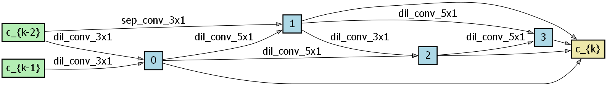
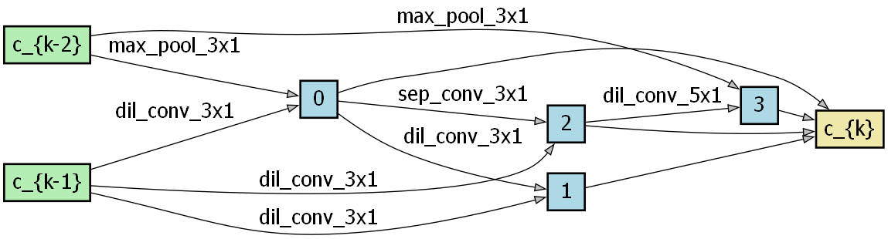
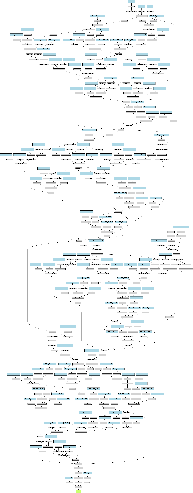

# Automated Neural Architecture Search for Financial Forecasting
This project automates the design of a neural network for a challenging task: predicting the next-day price movement of the S&P 500 ETF (SPY). It uses Differentiable Architecture Search (DARTS) to efficiently discover an optimal model structure tailored to noisy financial data. The final discovered architecture achieves 57% accuracy on the unseen test set.

## How It Works: Differentiable Architecture Search (DARTS)
Neural Architecture Search (NAS) automates the design of neural networks. Instead of a human hand-picking layers, a search algorithm finds the best combination.

DARTS makes this process incredibly efficient. Traditional NAS methods are brute-force and can cost thousands of GPU-days. DARTS reframes the search as a differentiable problem that can be solved with gradient descent. It learns a probability distribution over all possible operations (e.g., convolutions, pooling) and connections, allowing it to explore a vast search space in a fraction of the time.

At the end of the search, the most likely operations are selected to form the final architecture, which is then trained from scratch.

## Data and Training
Feature Engineering
Financial data is notoriously noisy. To create a clearer signal for the model, the raw price data was transformed:

Price Stationarity: Core features (Open, High, Low, Close, Volume) were converted into percentage changes.

Technical Indicators: The feature set was enriched with common technical indicators like SMA, RSI, MACD, ATR, and ROC to provide more context.

Final Model Training
After discovering the best architecture, the final model was trained with a focus on regularization to prevent overfitting:

Dropout: A 50% dropout rate was used before the final classifier.

Weight Decay: A strong L_2 regularization of 1e-3 helped simplify the model.

Weighted Loss: To handle the class imbalance between "Up" and "Down" days, misclassifying the minority class ("Down/Same") was penalized with a 1.7x higher weight.
## Project Structure 
```
NAS-Financial-Forecasting/
│
├── data/                     # Stores raw and processed data
├── reports/                  # Stores the discovered genotype and results
├── src/                      # All Python source code
│   ├── config.py             # Central configuration for all parameters
│   ├── data_loader.py        # Handles data download and feature engineering
│   ├── search_space.py       # Defines the building blocks (operations) for NAS
│   ├── model.py              # Defines the Network and Cell classes for search/training
│   ├── search.py             # Main script to run the architecture search
│   ├── train.py              # Main script to train and evaluate the final model
│   ├── utils.py              # Helper functions for accuracy, plotting, etc.
│   ├── visualize.py          # Script to visualize the discovered cell architectures
│   └── visualize_network.py  # Script to visualize the full stacked network
│
├── requirements.txt          # Project dependencies
└── README.md                 # This file
```

## How to Run the Project 
Setup Environment:

```python
pip install -r requirements.txt
```


Prepare Data:
Run this script once to download and process the data.

```python
python src/data_loader.py
```


Discover the Architecture:
This will run the DARTS search and save the best discovered architecture to reports/genotype.json.

```python
python src/search.py
```


Train and Evaluate the Final Model:
This loads the discovered genotype, trains it from scratch with full regularization, and evaluates its final performance.

```python
python src/train.py
```


(Optional) Visualize the Architectures:
After the search is complete, run these scripts to generate diagrams.
```python
python src/visualize.py          # For individual cells
python src/visualize_network.py  # For the full network
```

## Final Results 
Performance Metrics
The final model was evaluated on a completely unseen test set.

```
Classification Report:

              precision    recall  f1-score   support

   Down/Same       0.42      0.22      0.29        96
          Up       0.61      0.80      0.69       144

    accuracy                           0.57       240
   macro avg       0.51      0.51      0.49       240
weighted avg       0.53      0.57      0.53       240

```

The final accuracy of 57% demonstrates a predictive edge over a random baseline. For a task such as predicting next-day price movement, that is adequate.

Discovered Architecture Analysis
The visualize.py script generates diagrams of the two fundamental building blocks discovered by DARTS.

Normal Cell (Feature Extractor)
The normal cell is responsible for processing features without changing the data's dimensions. The search algorithm converged on a structure dominated by dilated and separable convolutions. This indicates that learning patterns across multiple time scales (3x1 and 5x1 kernels) in parallel is the most effective strategy for this dataset.


Reduction Cell (Downsampler)
The reduction cell's job is to reduce the sequence length and increase the feature depth. DARTS discovered a hybrid structure that uses max pooling for efficient downsampling while simultaneously applying convolutions to continue extracting features during the reduction process. This creates a powerful and hierarchical representation of the data as it flows through the network.


The Full Model Stack
The final network is a deep CNN created by stacking the discovered Normal and Reduction cells in a predefined sequence. This creates a hierarchical feature extractor.
Note: The full network graph is highly detailed and best viewed by opening the image and zooming in.

The model consists of:
A Stem: A single convolution layer for initial processing.
A Body: A stack of 4 cells (Normal -> Reduction -> Reduction -> Normal) that progressively learn more abstract features.
A Head: A final set of layers (Pooling, Dropout, Classifier) that make the binary prediction.


## Citations 
Liu, H., Simonyan, K., & Yang, Y. (2018). DARTS: Differentiable Architecture Search. arXiv preprint arXiv:1806.09055. https://doi.org/10.48550/arXiv.1806.09055